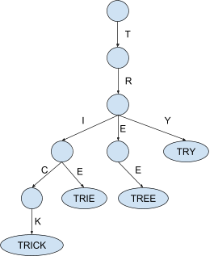
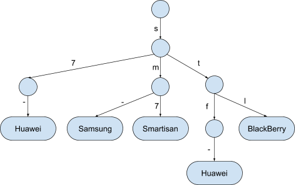
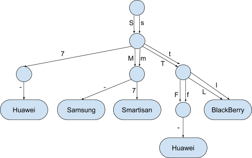
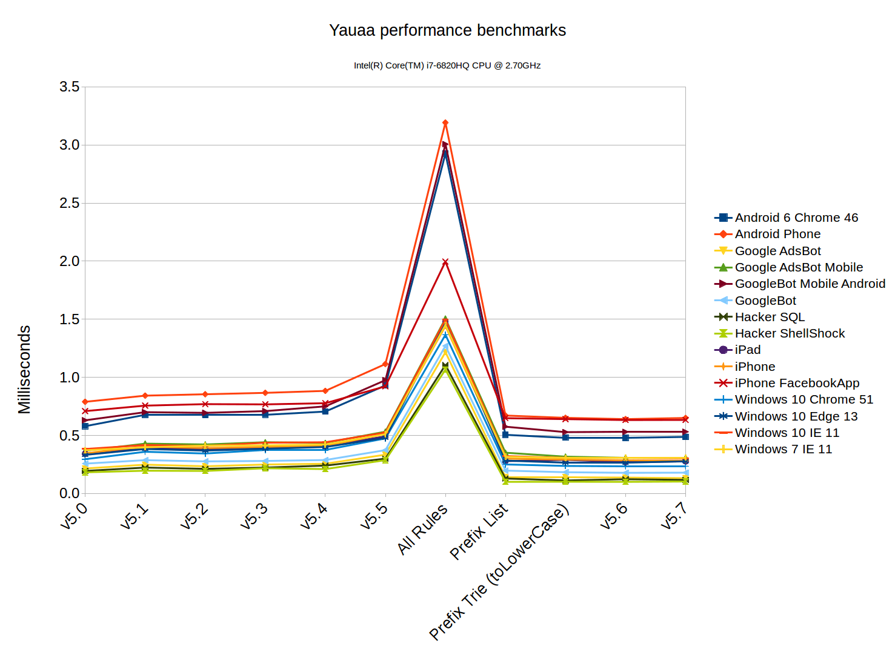

Introduction
===
I work at bol.com as an IT-Architect.
I wrote this article in late 2018 for [the bol.com techlab blog website](https://techlab.bol.com/finding-the-longest-matching-string-prefix-fast/).

This is simply a 'republish' this article.

***

Finding the longest matching string prefix … fast
====
In many systems at bol.com the response speed of our systems is very important.
This blog is about the data structures and algorithms we used to make a specific analysis step a lot faster: Finding the longest matching string prefix.

Our use case: The user agent string
===
When a web browser makes a request to a website a so called “user agent string” is sent along with the request.
This user agent string is a text that (in general) describes both the device and the application used to interact with the website.
Take for example the current user agent string of my phone

    Mozilla/5.0 (Linux; Android 7.1.1; Nexus 6) AppleWebKit/537.36 (KHTML, like Gecko) Chrome/70.0.3538.80 Mobile Safari/537.36

this indicates to the website I am using __Chrome 70__ on a __Phone__ called __Nexus 6__ running __Android 7.1.1__ to interact with them.

At bol.com we use this type of analysis to determine if we should send either the “mobile” or the “desktop” variant of the website to the user requesting a page.
We also use this analysis afterwards to see if visitors using specific browsers or devices have problems using our website.
For both of these types of use cases being able to do this analysis as fast as possible is important to us.

Analyzing the device model
===
As described in two previous articles (
[For better device profiling, delete your DDR!](https://techlab.bol.com/better-device-profiling)
 and [Making sense of the user agent string](https://techlab.bol.com/making-sense-user-agent-string) )
 we use an opensource tool called [Yauaa (Yet Another UserAgent Analyzer)](https://yauaa.basjes.nl) for analyzing the user agent string.

One of the slowest steps in the analysis of Yauaa is the classification of the brand of device that was used.
The reason behind this slowness lies in the kind of data we need to analyze.
To give some sense of the reality of this data some production examples of the model indicator fragments we see in production:

    A1
    ARCHOS 79 Platinum
    Archos_80_Helium_4G
    Blade L3 Plus
    BLA-L29
    GT-I9195I
    SAMSUNG SM-G920F/G920FXXEinterim
    SonyC2104
    SonyEricssonE10a
    SM - G900H
    SM-G900M

As you can see sometimes it simply starts with the name of the brand followed by a model indicator.
Sometimes the brand and model are separated, sometimes they are not.
Some are uppercase, lowercase or camelcase.

Yet in most situations we see that there is no clear indication of brand at all.
Even worse; some models appear in multiple brands: The model “A200” is a valid model for at least Acer, Celkon, Lenovo, LG, Rivo, Samsung and QMobile.
You can see that this analysis is always a “best guess”, yet when looking at large groups of visitors it is still very useful to detect that problems are brand and/or device related.

Luckily in most situations (i.e. the most popular brands) the problem can be reduced to the question if the model indicator “starts with” one of the known prefixes.
And this is what Yauaa does.
The Yauaa ruleset currently includes about 500 prefixes that need to be checked.

Some of the prefixes we look for are:

    "ONETOUCH"   : "Alcatel"
    "Aspire"     : "Acer"
    "Kindle"     : "Amazon"
    "PadFone"    : "Asus"
    "Passport "  : "BlackBerry"
    "Pixelbook"  : "Google"
    "Hero"       : "HTC"
    "Ascend"     : "Huawei"
    "ThinkPad"   : "Lenovo"
    "Yoga"       : "Lenovo"
    "Xoom"       : "Motorola"
    "Redmi "     : "Xiaomi"
    "BZA-"       : "Huawei"
    "RS98"       : "LG"
    "Z2"         : "Motorola"
    "RM-"        : "Nokia"
    "GT-"        : "Samsung"
    "SM-"        : "Samsung"

More and more brands
===
In Yauaa a specialized analysis language has been created to allow creating user agent detection patterns more easily.
Initially the device brand detection looked for a small number of patterns and as such these rules had been implemented manually in this analysis language.

Over time more and brand patterns were added and soon a bash script was created to generate these rules from a csv file.

In late 2018 a large number of brand patterns was added that effectively made the performance impact unacceptable (startup time, memory footprint and the used cpu time to do the analysis).

So this part of the analysis engine was due for a redesign.

Finding the longest matching prefix
===
The first thing that was done is to add a function to the detection language that allows looking for prefixes in a configured set.
This meant the large number of old rules were removed and replaced by a small number of new rules that use the new function.

During development the simplest possible implementation was created to aid in the development of the new rules.
In this solution we store the lowercase of all prefixes in an ordered list and simply sequentially search for the longest matching one.
We store the lowercase version because we need a case insensitive match and there is no ‘startsWithIgnoreCase’ in Java.

So simplified this first implementation looked like this:

Prepare:
- Create a list of the prefixes and the related brand.
- Make all the prefixes lowercase.
- Order the list by the length of the prefix.

Longest one first.

Run:
- Lowercase the provided model
- For each prefix in the list
  - if ( model startsWith prefix )
    - Return the brand associated with the prefix.

This solved the memory problem and the performance was also already a lot better.

This initial implementation was able to do 1M matches in a few seconds.

For a first implementation this work quite well yet there was obviously a lot of room for improvement.
This was really a ‘brute force’ implementation.

Finding a better algorithm
===
Knowing that the first algorithm was not even close to being optimal in terms of speed the main question became to find “the fastest” algorithm.

The problem of “Finding the prefix that best matches the provided string” seemed to me like a solved problem.
I expected to find a working implementation in something like Apache Common Collections.
However … I couldn’t find it.

After some asking around my colleague [Oscar](https://techlab.bol.com/author/owestra/) said a
[Trie](https://en.wikipedia.org/wiki/Trie) is probably the most suitable data structure to handle this type of question.
The idea of Trie is that a tree structure is used where the nodes contain a letter and a walk from the root to the leaves is essentially spelling a word.

This structure looks really promising, however… this structure was originally designed as the solution for a completely different problem: Store values and retrieve the set of values that all have a specific prefix.
So a Trie is about storing multiple strings and the question is a single prefix to look for.

What we need to solve this problem is effectively the opposite of the retrieval pattern of a Trie: We have a text and need to find the value associated with the longest matching prefix.
So a structure that is about multiple prefixes and the question is a single string to look for.

Essentially we need a special form of TreeMap where the retrieval is about the “longest matching prefix” of the provided input instead of the “exact match” of the key.

Making a “Prefix-Trie-TreeMap” ...
===
After some investigation, I decided to use the data structure of the Trie and create what is essentially a map of prefixes and values.

To illustrate the idea let’s assume this sample of the prefixes

    "S7-"    : "Huawei"
    "SM-"    : "Samsung"
    "SM7"    : "Smartisan"
    "STF-"   : "Huawei"
    "STL"    : "BlackBerry"

The data structure for this sample would be something like this:

Implementation assumptions
===
In the actual implementation I made a few assumptions that are only valid for this specific use case.
The most important assumption is that all letters in all prefixes are in the readable ASCII range: i.e. from 32 (‘ ‘) until 126 (‘~’).

So to make the lookup of the next node in the tree as fast as possible a node in the tree simply has an array with the next layer of nodes.
The letter in the word is simply the index in that array.
This is not the cheapest in terms of memory (all nodes have an array of 128 elements, most are null) but it is the fastest I could think of.

Now the algorithm to find the best prefix is a recursive one:

Prepare:
- Create a list of the prefixes and the related brand.
- Make all the prefixes lowercase.
- Build the “Trie like” data structure as shown

Run
- Lowercase the model
- Take the letter the matches the depth in the tree.
- If the array has an entry to a next level
    - then recurse in
    - else track back and retain the deepest available value

A quick benchmark showed that this was already a lot faster than the List implementation.
Yet I quickly saw still more room for improvement.

Making it faster
===
Looking at the code I realized that there was a step in there that made the system go over the input twice: There was a toLowerCase call that created a new String from the input by going over all the letters.
Can we get rid of this step?

What I quickly realized is that the array in the node already had an index position for both the lower and the uppercase variants of the letter.
So the final speedup I found is that by linking the next node in the tree in both the indexes of the lower and the uppercase in the array.

For some letters there is no difference between the lower and the uppercase  (like ‘7’) so the final form of the tree looks like this:

Now there is no need to put the input through the toLowerCase function anymore because this tree structure has all possible permutations of upper and lowercase.

How much did all of this help?
===
To get a somewhat realistic feeling of the relative speed between the three algorithms shown in this article all model fields from the known test cases are matched against the full set of rules (Yauaa v5.7).

By doing the same set of tests in the same way against all three algorithms the average(!) time needed to do a single lookup were as follows:

| Implementation | Time per lookup |
| --- | --- |
| Using the ordered list:               | 2000ns each. |
| The Trie with toLowerCase:            | 90ns each. |
| The double Trie without toLowerCase:  | 25ns each. |

So the removal for the need of the toLowerCase made the lookup 3 times faster at no extra memory usage! Overall these changes made a single lookup about 80 times faster (under this test data, your mileage will be different).

So this seems like really good steps forward.

But in the real context ... it didn’t really matter.

Running the Yauaa parsing benchmarks showed this over the last few versions:

So in the context of the application the removal of the vast number of rules and replacing them by a bit of Java code made a massive impact (81% less time spent).
The subsequent improvements of switching from the List implementation to the Trie with toLowerCase resulted in only about 4.4% speedup compared to the List.
Yet the switch to the Trie without toLowerCase  made almost no impact in this use case: &lt; 1% .

More and more rules
===
At first glance one might conclude that there is no need for the Trie setup as it is more complex and the performance difference is very close to the confidence interval of the testing tool (i.e.
the measured performance difference could be a measuring error).

But as you may know I’m always looking for the scalability of solutions; how will it behave under a bigger load?

To examine this question I ran a few additional performance tests.

For these performance tests I created this set of prefixes: “[A-Z][A-Z][A-Z]-” and then merged it with the 500 prefixes we used in the previous tests which resulted in a set of 17970 different prefixes.

With the 500 prefixes the List variant took 2000ns to do a single lookup.
But because the system has to go through a large part of this list the average lookup time went from 2000ns to ~96000ns when using the 17970 prefixes.
So the number of prefixes directly affects the performance in a dramatic way and it becomes too slow very quickly.
The only upside of this implementation is that the memory usage only went from ~2MiB to ~5MiB.

Doing the same for the final Prefix Trie yielded a much better result.
Although the memory usage went from ~2MiB to ~12MiB the performance stayed the same: ~25ns

| v Implementation                      | 500 rules         | 17970 rules    | x 36 |
| ---                                   | ---               | ---            | ---  |
| Using the ordered list:               | 2000ns each.      | 96000ns each.  | x 48 |
| The Trie with toLowerCase:            | 90ns each.        | 90ns each.     | x 1  |
| The double Trie without toLowerCase:  | 25ns each.        | 25ns each.     | x 1  |

So there is a tradeoff between memory usage and performance.

Conclusions
===
The change to the fundamentally different way of checking which prefix was most applicable had a significant impact on both the memory usage, the startup time and also the running time of doing a non cached analysis.

The subsequent steps in improving the performance of these methods only seemed to have a minimal effect on the overall performance of the application.
This was however a deception because this was only true for the current set of rules.
It is certain that in the future the set of rules will grow and then the stable performance is the biggest advantage of the final solution.

Lessons learned:

1. Optimizing an algorithm goes beyond simply rewriting ifs and loops, it requires rethinking the data structures and how you use them to find the needed answer.
1. The only way to know the true impact of a changed algorithm is by implementing the idea and benchmarking it.
1. The impact of a new algorithm in a larger system can only be assessed by benchmarking the entire system with as realistic data as possible.
An algorithm that only takes 0.1% of the time can be made a 1000 times faster and no one will notice.
1. When running benchmarks remember to look at
    1. The needed CPU time
       Is it fast enough?
    1. The needed memory
       Can still fit it in the computer’s RAM where you intend to run it?
    1. The garbage collection impact
       Everything you allocate must be cleaned up (in many modern languages).
1. The question you must keep in mind is what you are optimizing for and if it can run where it is needed.
   Designing a smart data structure makes a huge difference in all of these aspects.

So for this use case; Was it worth it doing these improvements?

Yes, it was for several reasons:

- We now have a very fast (fastest?) solution that will remain very fast when extending the list of prefixes.
This is now a ‘solved problem’ and if we need to understand it again we can simply read this article.
- We learned a lot about the relative performance impact of various operations.
So in later projects we can carry this with us and get to the fastest solution quicker.
- It was a lot of fun to figure this out.
This is actually the most important reason of them all.

Future
===
I don't like having to solve the same problem in the future.
So I've started to contribute this back to where I expected to find it in the first place: [Apache Commons Collections](https://issues.apache.org/jira/browse/COLLECTIONS-707)

